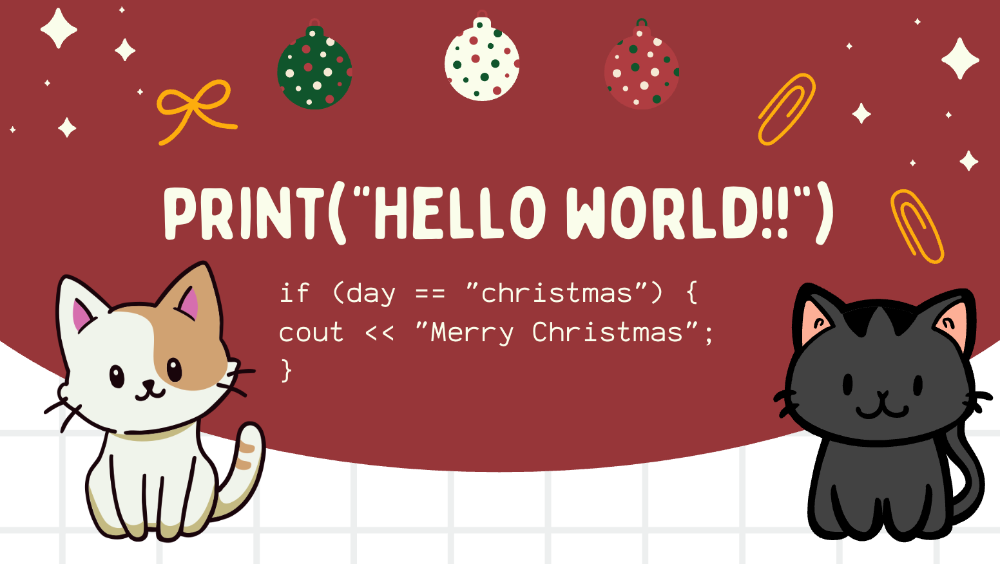

<h1 align="center">Welcome to <a href="https://github.com/CameronBustamanteLeveau2">Charllotte </a>'s Profile 🤭</h1>

I'm a Full Stack Developer in training, passionate about creating complete and functional web applications. I have experience in both front-end and back-end development, combining design, usability, and programming to deliver engaging and efficient solutions.

  

<h3>Hi, I'm Charlotte Cameron Bustamante Leveau!</h3> 
 I am a Full Stack Developer passionate about building complete, efficient, and scalable web solutions. I have professional experience combining front-end (with React.js, Vue.js, and Vanilla JS) and **back-end** (with Node.js, Express, Flask, and C#/.NET Core) to deliver products from design to final implementation. 
 
 My focus is on applying UX/UI design** principles to enhance usability and create exceptional user experiences. 

 

In addition, I enjoy exploring new technologies, contributing to open source projects, and collaborating with fellow developers.  
I’m always excited to improve my skills and learn something new every day.

#### LANGUAGES AND TECHNOLOGIES

  
## GitHub Trophies

  

## GitHub Stats

<table width="100%">
  <tr>
    <td width="50%">
      <h3 align="center">Racha de contribuciones</h3>
      

        
      

    </td>
    <td width="50%">
      <h3 align="center">Top Contribuciones</h3>
      

        
      

    </td>
  </tr>
</table>

##  Popular Projects

<table width="100%">
  <tr>
    <td width="50%">
      
    </td>
    <td width="50%">
      
    </td>
  </tr>
</table>

##  I Spent My Time On

###  Programming Languages

| Language       | Time Spent                                                         |
| -------------- | ------------------------------------------------------------------ |
| **HTML**       |        |
| **CSS**        |                 |
| **Python**     |         |
| **Git/GitHub** |             |
| React          |        |
| Kotlin         |         |
| JavaScript     |  |

### Editors / IDEs

| Editor / IDE       | Usage                                                                     |
| ------------------ | ------------------------------------------------------------------------- |
| **VS Code**        |           |
| **IntelliJ IDEA**  |            |
| **Eclipse**        |                |
| **Rider**          |                     |
| **WebStorm**       |              |
| **Android Studio** |  |

### Operating Systems
| OS               | Usage                                                          |
| ---------------- | -------------------------------------------------------------- |
| **Linux Ubuntu** |  |
| **Windows**      |     |
| Mac              |             |

---

## Contributions Chart

  

## Quote of the Day

  

---

## 🎄✨ Merry Christmas & Happy Holidays! ✨🎄

  
 
 
      <!-- ajusta la cantidad de   para bajar más -->

### 🎁 **Wishing you a wonderful holiday season and a happy New Year!**  
— _Charlotte_

Credit: [CameronBustamanteLeveau2](https://github.com/CameronBustamanteLeveau2)

Last Edited on: 12/07/2025

      <!-- ajusta la cantidad de   para bajar más -->

      <!-- ajusta la cantidad de   para bajar más -->

## Connect With Me

  
  
  

  

